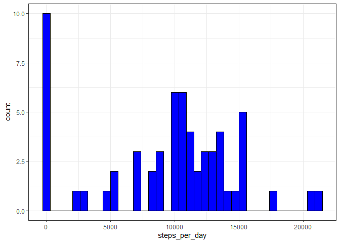
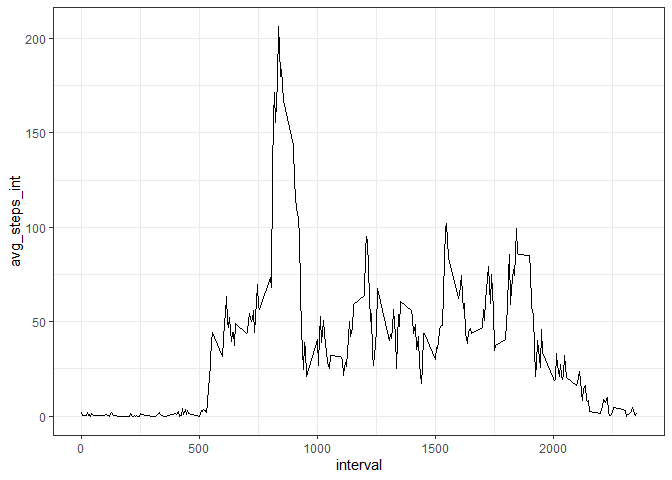
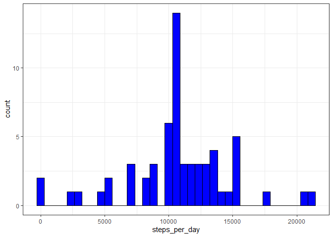
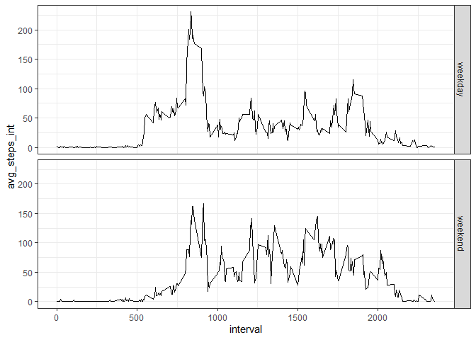

## Loading and preprocessing the data

```r
library(dplyr)
library(ggplot2)
unzip("activity.zip")
activity <- read.csv('activity.csv')
activity$date <- as.Date(activity$date, '%Y-%m-%d')
str(activity)
```

```
## 'data.frame':	17568 obs. of  3 variables:
##  $ steps   : int  NA NA NA NA NA NA NA NA NA NA ...
##  $ date    : Date, format: "2012-10-01" "2012-10-01" ...
##  $ interval: int  0 5 10 15 20 25 30 35 40 45 ...
```

## What is mean total number of steps taken per day?

Calculate total daily steps

```r
step_sum <- activity %>% group_by(date) %>% summarise(steps_per_day=sum(steps, na.rm=T))
head(step_sum)
```

```
## # A tibble: 6 x 2
##   date       steps_per_day
##   <date>             <int>
## 1 2012-10-01             0
## 2 2012-10-02           126
## 3 2012-10-03         11352
## 4 2012-10-04         12116
## 5 2012-10-05         13294
## 6 2012-10-06         15420
```
Plot a histogram of total daily steps

```r
g <- ggplot(step_sum, aes(steps_per_day)) +
geom_histogram(fill='blue', color='black', bins=37)+theme_bw()
print(g)
```

<!-- -->

Calculate average daily steps


```r
mean(step_sum$steps_per_day, na.rm=T)
```

```
## [1] 9354.23
```

Calculate Median Daily Steps


```r
median(step_sum$steps_per_day, na.rm=T)
```

```
## [1] 10395
```


## What is the average daily activity pattern?

Calculate average steps in each interval

```r
int_avg_steps <- activity %>% group_by(interval)%>% summarise(avg_steps_int=mean(steps, na.rm=T))
head(int_avg_steps)
```

```
## # A tibble: 6 x 2
##   interval avg_steps_int
##      <int>         <dbl>
## 1        0        1.72  
## 2        5        0.340 
## 3       10        0.132 
## 4       15        0.151 
## 5       20        0.0755
## 6       25        2.09
```

Time series plot of average steps by interval


```r
t <- ggplot(int_avg_steps, aes(x=interval, y=avg_steps_int))+geom_line()+theme_bw()
print(t)
```

<!-- -->

Find interval with maximum steps


```r
max_steps_int <- filter(int_avg_steps, avg_steps_int==max(avg_steps_int))
print(max_steps_int)
```

```
## # A tibble: 1 x 2
##   interval avg_steps_int
##      <int>         <dbl>
## 1      835          206.
```


## Imputing missing values

Total number of missing values


```r
missing_values <-sum(!complete.cases(activity))
print(missing_values)
```

```
## [1] 2304
```

Impute missing steps by the average steps in each interval

Create interval average values


```r
int_avg <- function(interval){
         return(mean(activity$step[activity$interval==interval], na.rm=T))
}
int_a <- sapply(activity$interval, int_avg)
head(int_a)
```

```
## [1] 1.7169811 0.3396226 0.1320755 0.1509434 0.0754717 2.0943396
```

Impute steps using int_avg values


```r
impute_steps <- function(steps, int_a){
        out <- steps
        for (i in 1:length(steps)){
                if (is.na(steps[i])){
                        out[i] <- int_a[i]
                } else {
                        out[i] <- steps[i]
                }
        }
        return(out)
}
steps <- impute_steps(activity$steps, int_a)
head(steps)
```

```
## [1] 1.7169811 0.3396226 0.1320755 0.1509434 0.0754717 2.0943396
```

Create new data set with imputed steps


```r
activity.new <- activity
activity.new$steps <- steps
head(activity.new)
```

```
##       steps       date interval
## 1 1.7169811 2012-10-01        0
## 2 0.3396226 2012-10-01        5
## 3 0.1320755 2012-10-01       10
## 4 0.1509434 2012-10-01       15
## 5 0.0754717 2012-10-01       20
## 6 2.0943396 2012-10-01       25
```

Histogram of the new data reflects that missing data was removed and due to the imputation mean and median are now the same and more accurate


```r
step_sum_new <- activity.new %>% group_by(date) %>% summarise(steps_per_day=sum(steps))
head(step_sum_new)
```

```
## # A tibble: 6 x 2
##   date       steps_per_day
##   <date>             <dbl>
## 1 2012-10-01        10766.
## 2 2012-10-02          126 
## 3 2012-10-03        11352 
## 4 2012-10-04        12116 
## 5 2012-10-05        13294 
## 6 2012-10-06        15420
```

```r
n <- ggplot(step_sum_new, aes(steps_per_day)) +
        geom_histogram(fill='blue', color='black', bins=37)+theme_bw()
print(n)
```

<!-- -->

Average of the imputed daily steps 


```r
mean(step_sum_new$steps_per_day)
```

```
## [1] 10766.19
```

Median of the imputed daily steps


```r
median(step_sum_new$steps_per_day)
```

```
## [1] 10766.19
```


## Are there differences in activity patterns between weekdays and weekends?

Create new variable for weekdays and weekends


```r
days <- weekdays(activity.new$date)

wkdays <- function(days){
        out <- days
        for (i in 1:length(days)){
                if (days[i] %in% c('Saturday', 'Sunday')){
                        out[i] <- 'weekend'
                } else {
                        out[i] <- 'weekday'
                }
        }
        return(out)
}
activity.new$day <- wkdays(days)
activity.new$day <- as.factor(activity.new$day)
str(activity.new)
```

```
## 'data.frame':	17568 obs. of  4 variables:
##  $ steps   : num  1.717 0.3396 0.1321 0.1509 0.0755 ...
##  $ date    : Date, format: "2012-10-01" "2012-10-01" ...
##  $ interval: int  0 5 10 15 20 25 30 35 40 45 ...
##  $ day     : Factor w/ 2 levels "weekday","weekend": 1 1 1 1 1 1 1 1 1 1 ...
```

Plot average steps by interval on weekdays and weekends


```r
int_avg_steps_new <- activity.new %>% group_by(interval, day)%>% summarise(avg_steps_int=mean(steps, na.rm=T))
head(int_avg_steps_new)
```

```
## # A tibble: 6 x 3
## # Groups:   interval [3]
##   interval day     avg_steps_int
##      <int> <fct>           <dbl>
## 1        0 weekday        2.25  
## 2        0 weekend        0.215 
## 3        5 weekday        0.445 
## 4        5 weekend        0.0425
## 5       10 weekday        0.173 
## 6       10 weekend        0.0165
```

```r
w <- ggplot(int_avg_steps_new, aes(x=interval, y=avg_steps_int))+
        geom_line()+facet_grid(day ~ .)+theme_bw()
print(w)
```

<!-- -->

